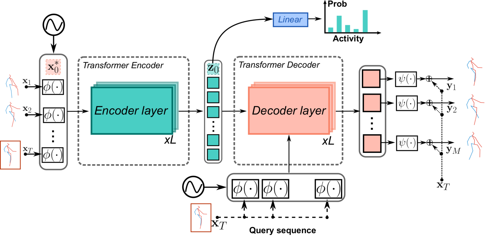
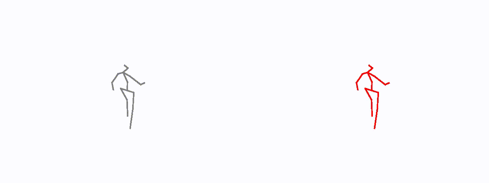

# Pose Transformers: Human Motion Prediction with Non-Autoregressive Transformers





This is the repo used for human motion prediction with non-autoregressive
transformers published with our [paper](https://openaccess.thecvf.com/content/ICCV2021W/SoMoF/papers/Martinez-Gonzalez_Pose_Transformers_POTR_Human_Motion_Prediction_With_Non-Autoregressive_Transformers_ICCVW_2021_paper.pdf)



## Requirements

* **Pytorch**>=1.7.
* **Numpy**.
* **Tensorboard** for pytorch.

## Data

We have performed experiments with 2 different datasets

1. **H36M**
2. [**NTURGB+D**](https://rose1.ntu.edu.sg/dataset/actionRecognition/) (60 actions)

Follow the instructions to download each dataset and place it in ```data```.

**Note**. You can download the H36M dataset using ```wget http://www.cs.stanford.edu/people/ashesh/h3.6m.zip```.
However, the code expects files to be **npy** files instead of **txt**.
You can use the script in ```data/h36_convert_txt_to_numpy.py``` to convert to ***npy*** files.

## Training

To run training with H3.6M dataset and save experiment results in ```POTR_OUT``` folder
run the following:


```
python training/transformer_model_fn.py \
  --model_prefix=${POTR_OUT} \
  --batch_size=16 \
  --data_path=${H36M} \
  --learning_rate=0.0001 \
  --max_epochs=500 \
  --steps_per_epoch=200 \
  --loss_fn=l1 \
  --model_dim=128 \
  --num_encoder_layers=4 \
  --num_decoder_layers=4 \
  --num_heads=4 \
  --dim_ffn=2048 \
  --dropout=0.3 \
  --lr_step_size=400 \
  --learning_rate_fn=step \
  --warmup_epochs=100 \
  --pose_format=rotmat \
  --pose_embedding_type=gcn_enc \
  --dataset=h36m_v2 \
  --pre_normalization \
  --pad_decoder_inputs \
  --non_autoregressive \
  --pos_enc_alpha=10 \
  --pos_enc_beta=500 \
  --predict_activity \
  --action=all
```

Where ```pose_embedding_type``` controls the type of architectures of networks 
to be used for encoding and decoding skeletons (\phi and \psi in our paper). 
See ```models/PoseEncoderDecoder.py``` for the types of architectures.
Tensorboard curves and pytorch models will be saved in ```${POTR_OUT}```.


# Citation

If you happen to use the code for your research, please cite the following paper

```
@inproceedings{Martinez_ICCV_2021,
author = "Mart\'inez-Gonz\'alez, A. and Villamizar, M. and Odobez, J.M.",
title = {Pose Transformers (POTR): Human Motion Prediction with Non-Autoregressive Transformers},
booktitle = {IEEE/CVF International Conference on Computer Vision - Workshops (ICCV)},
year = {2021}
}
```


